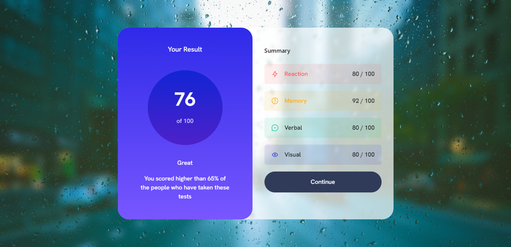

# Results summary component[3D Effect]

## Table of contents

- [The challenge](#the-challenge)
- [Screenshot](#screenshot)
- [Links](#links)
- [My process](#my-process)
  - [Built with](#built-with)
  - [What I learned](#what-i-learned)
- [Author](#author)

## Overview

### The challenge

Users should be able to:

- View the optimal layout for the interface depending on their device's screen size
- See hover and focus states for all interactive elements on the page

### Screenshot

### Links

- Live Site URL: [Results Summary](https://results-summary.netlify.app)

## My process

### Built with

- Semantic HTML5 markup
- CSS custom properties
- Flexbox
- Mobile-first workflow
- [React](https://reactjs.org/) - JS library
- [Tailwind CSS](https://tailwindcss.com/) - CSS Framerwork
- [Vite](https://styled-components.com/) - used with react for faster builds

### What I learned

Learned how to add 3d effect to card components

## Author

- Frontend Mentor - [@newton](https://www.frontendmentor.io/profile/newton-w)
- LinkedIn - [@newton](https://www.linkedin.com/in/newton-warui/)
